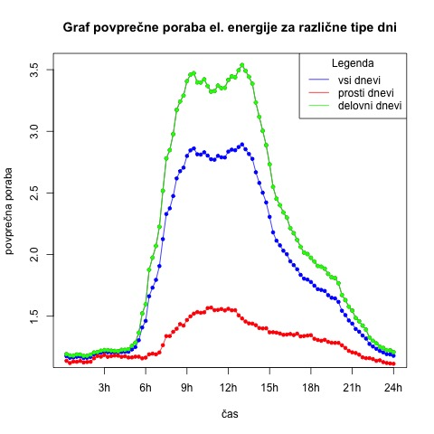

```{r setup, echo=FALSE, results='hide', message=FALSE, warning=FALSE}
knitr::opts_chunk$set(echo=FALSE, message=FALSE, warning=FALSE)

## Uvoz vseh potrebnih knjižnic
source("lib/libraries.r",encoding="UTF-8")
setwd("/Users/blazpovh/Documents/R_projektna_naloga/APPR-2021-22-Blaz-Povh/")
```

## Motivacija

Od trenutka, ko sem izvedel, da bom moral pri predmetu analiza podatkov s programom `R` narediti projektno nalogo, sem si zadal cilj to nalogo narediti čim bolj zanimivo in zahtevno ter od sebe oddati dober projekt.
Imel sem malo predhodnega znanja s podobnimi računalniškimi programi, zato sem imel željo pridobiti čim več uporabnega znanja tekom te projetkne naloge, saj v svetu kakršnem živimo ta znanja postajajo čedalje bolj cenjena ter iskana.
Tako sem iskal čimbolj inovativno ter hkrati uporabno temo, ki bi mi lahko še prišla kdaj prav kasneje. Zagrabil sem  priložnost na Razvojnem centru Novo mesto, kjer občasno izvajam delavnice za otroke, ko so mi predstavili, da iščejo nekoga, ki bi jim pomagal pri projektu.
Lotil sem se zanimive teme - analize pretekle porabe in izdelave preprostih napovedi bodoče porabe električne energije za različne porabnike.
Tekom dela sem se znašel v veliko napornih trenutkih, ko nisem vedel kaj narediti in kako nadaljevati, vendar sem imel dovolj motivacije, da sem nalogo pripeljal do konca. 


## Opis problema
V sklopu te naloge sem naredil delno analizo pretekle porabe električne energije za 50 porabnikov, preverjal povezave med koledarskimi ter vremenskimi podatki in preverjal, kako se poraba razlikuje za različne dneve in kako je povezana z vremenskimi podatki.
Na koncu pa sem  naredil še napovedni model, ki v grobem iz danih podatkov za preteklo porabo izračuna napoved porabe električne energije za naslednji dan.
Pridobil sem tudi podatke o povprečni temperaturi za slovenske regije in jih grafično prikazal.

## Obdelava, uvoz in čiščenje podatkov
Kar se tiče podatkov, sem imel srečo, saj so mi večino podatkov posredovali iz Razvojnega centra Novo mesto. Glavni vir podatkov predstavlja 50 datotek s podatki o porabi električne energije za različne porabnike (vsaka datoteka za enega  porabnika). Slednje sem prejel v formatu JSON. Vsebujejo pa podatke za prvih 199 dni v letu 2021, kjer beležijo porabo za vsakega porabnika na za vsak 15 minutni interval  za vseh 200 dni od 1.1.2021 dalje. Spodaj je mogoče videti kratek izsek surovih podatkov za prvega porabnika v JSON formatu. Polje `values` vsebuje vektor 96 meritev za vsak dan.
Podatki so anonimizirani, zato ne vem, kateremu porabniku pripadajo. Iz kasnejših analiz pa sklepam, da je vmes vsaj kakšno industrijsko podjetje, ki med tednom v delovnih urah močno poveča svojo porabo električne energije.

```r
{"date":"2021-01-01","datetime":"2020-12-31T23:15:00+00:00","status":"ED0","values":[1.43,1.4175,1.3975,1.4025,1.395,1.395,1.4,1.4,1.4,1.3925,1.3975,1.4,1.4,1.3975,1.3925,1.4225,1.3575,1.205,0.935,0.9275,2.7625,2.1375,0.9225,0.925,3.4275,1.72,0.9275,0.925,3.9975,1.1325,0.9325,1.315,1.3475,0.8325,0.8375,0.8425,4.2125,0.84,0.8425,2.4675,1.3475,0.8375,0.835,3.305,0.83,1.405,2.6175,0.955,3.135,1.445,1.3025,1.2975,1.32,1.3475,1.305,1.3075,1.31,1.3025,1.3475,1.31,1.305,1.3075,1.3025,1.2775,1.26,0.9725,0.935,0.925,0.93,3.16,0.925,1.48,2.525,0.925,2.775,1.4325,0.925,3.1775,0.9225,1.6825,2.4475,0.925,3.14,1.055,1.025,3.06,0.9225,3.045,0.9275,2.13,1.9325,3.28,0.925,1.9775,2.25,1.0475]},{"date":"2021-01-02","datetime":"2021-01-01T23:15:00+00:00","status":"ED0","values":
```

Naslednji sklop podatkov predstavljajo koledarski podatki za omenjenih 200 dni. Ti podatki vsebujejo informacijo o tem ali je dan dela prost ali ne  ter kateri dan v tednu je, prejel pa sem jih v formatu csv. Ti podatki so mi v nadaljevanju zelo uporabni pri analizah. Surovi podatki pa izgledajo nekako takole:

```r
"","date","dayHours","dayName","dayNum","freeDay","holidayName","index","monthNum","weekOfMonth","yearNum"
"1","2021-01-01",24,"Friday",1,TRUE,"New Year's Day",0,1,1,2021
"2","2021-01-02",24,"Saturday",2,TRUE,"New Year's Day",1,1,1,2021
"3","2021-01-03",24,"Sunday",3,TRUE,"",2,1,1,2021
"4","2021-01-04",24,"Monday",4,FALSE,"",3,1,2,2021
```

Zadnji sklop podatkov, ki sem jih prejel, pa so bili še vremenski podatki za te iste dneve. K sreči so vsi porabniki iz Ljubljane, tako da sem opazoval samo vreme v Ljubljani za omenjene dneve in to primerjal s porabo in iskal povezave. Tudi te podatke sem prejel v formatu JSON. Vsebujejo za vsak dan podatke o vlažnosti, padavinah, temperaturi, vetru in osončenosti, za vsake pol ure dneva. Prilagam kratek izsek surovih podatkov.

```r
[{"date":"2021-01-01","datetime":"2020-12-31T23:00:00+00:00","humidity":[98,98,98,98,98,98,99,99,99,99,100,99,99,99,99,99,99,99,99,99,97,96,95,94,94,92,90,89,88,88,87,86,88,89,92,93,95,95,95,95,96,96,96,97,97,97,97,98],"index":0,"precipitation":[0,0,0,0,0,0,0,0,0,0,0,0,0,0,0,0,0,0,0,0,0,0,0,0.1,0.1,0,0,0,0,0,0,0,0,0,0.2,0.1,0.1,0,0.1,0.1,0,0,0.
```

Ko pa sem se lotil vizualizacij podatkov na zemljevidu Slovenije, sem za to potreboval še podatke o povprečnih letnih temperaturah za vse slovenske regije. Geografske podatke o Sloveniji in njenih regijah sem pridobil iz 
[**gadm**](https://gadm.org). Podatke o povprečnih letnih temperaturah za različne slovenske kraje sem pridobil iz [**ARSO**](https://www.arso.gov.si).

## Priprava podatkov
Problema sem se lotil sistematično. V prvem sklopu sem se lotil samo podatkov o porabi električne energije za različne porabnike. Podatke za vsah 50 porabnikov sem združil v eno tidy.data tabelo, kjer stolpci predstavljajo meritve od 1 do 96. To namreč predstavljajo izmerjeno porabo električne energije za posamezen dan, kjer vsaka naslednja meritev predstavlja
porabo čez naslednjih 15 minut. V vrsticah pa se nahajajo porabe električne energije za vseh 50 porabnikov za prvih 199 dni v letu 2021. Ker se je 28.3.2021 premaknila ura, sem izgubil eno uro in posledično 4 podatke. Ker nisem hotel tega dneva ostraniti iz podatkov sem te vrednosti interpoliral z funkcijo na_approx. To tabelo porab sem v nadaljevanju projektne naloge uporabljal za temelj vseh analiz. 

Naslednja tabela prikazuje vzorec urejenih podatkov


```{r}
Tabela_porabe1 <- read.csv("~/Documents/R_projektna_naloga/APPR-2021-22-Blaz-Povh/podatki/zdruzeni_podatki/data_tidy2.csv", sep="")
Tabela_porabe1[1:5,1:8]
```

## Analiza in vizualizacije

### Analiza  porabe za različne tipe dni
Ko sem imel to tabelo narejeno sem se lotil prvih analiz. Zanimala me je povprečna poraba za vseh 199 dni. Potem pa sem se lotil podrobnejše analize. S pomočjo uvoza koledarskih podatkov sem pridobil podatek za vsak dan, ali je bil dan dela prost ali ne. Na podlagi tega me je zanimalo, za koliko se je razlikovala povprečna poraba za delovne in dela proste dni.


Narisal sem tri grafe, enega za povprečno porabo vseh 199 dni za vsak 15 minutni interval, enega za povprečno porabo po vseh delovnih dnevih ter enega za dela proste dni. Vse te grafe sem združil v enega, da so rezultati preglednejši. 

Združen graf pa izgleda takole: 



Iz grafa lahko razberemo številne (pričakovane) zaključke. Največji porabniki električne energije so pri nas zagotovo tovarne in podjetja, kjer je potrebno veliko elektrike, da vse normalno deluje. Zato je bilo pričakovati, da bo povprečna poraba mnogo višja za delovne dni kot za dela proste. Ta pričakovanja so se potrdila, saj se vidi občutna razlika na grafu. Ker pa je mnogo več delovnih dni kot dela prostih je tudi zato povprečna poraba za vseh 199 dosti podobnejša povprečni porabi za delovne dni. Iz grafa pa je moč tudi razbrati za katere ure v dnevu je poraba največja. Iz grafa se lepo vidi, da je to nekje med 6. in 18. uro, ko je večina ljudi v službi, vrh pa se doseže približno ob 13h.

### Analiza porabe za različne dni v tednu
V nadaljevanju sem hotel potrditi prejšnjo ugotovitev, da je ob vikendih poraba občutno manjša kot za prvih 5 dni v tednu. Tako sem izračunal povprečno porabo  za vsak dan v tednu in za vsak dan narisal svoj graf in slednje združil v en graf, da so rezultati bolj ilustrativni. 

Porabo za vsak dan posebej sem grafično prikazal ter nato združil vseh sedem grafov v enega za lažjo primerjavo.


Tudi tukaj ne morem reči, da sem prišel do kakšnih drastičnih novih spoznanj. Kot predvideno je poraba najvišja za dneve od ponedeljka do petka, ko ljudje hodijo v službe ter podjetja , še posebej proizvodna, obratujejo. V soboto je poraba bistveno manjša kot za prvih 5 dni v tednu, a je vseeno nekoliko višja kot v nedeljo. To si razlagam tako, da veliko uspešnih podjetij dela tudi ob sobotah. Hkrati pa so sobote dnevi, ko se še doma nekaj postori. Vsa ta opravila, ki se v nedeljo ponavadi ne delajo porabijo kar nekaj elektrike, kar je tudi po mojem mnenju razlog, zakaj je v soboto vidno višja poraba električne energije kot pa v nedeljo.

## Analiza porabe s pomočjo vremenskih podatkov

Za zadnji sklop analiz sem uporabil še vremenske podatke. Ti so mi povzročali največ problemov. Veliko problemov sem imel z uvozom. K sreči so vsi moji porabniki iz Ljubljane, zato sem potreboval vremenske podatke za omenjenih 199 dni le za Ljubljano. Moji vremenski podatki so vsebovali ogromno vremenskih parametrov, jaz pa sem želel stvar malce poenostaviti in sem zato izbral le podatke, ki bi rekel, da imajo največji vpliv na človeka. Tako sem pri vremenskih analizah opazoval temperaturne in padavinske podatke za prvih 199 dni v Ljubljani. 

V nadaljevanju pa me je zanimalo kakšen vpliv imajo temperature in padavine na povprečno porabo električne energije, kar je bil moj primarni cilj v tem poglavju. Pri tem sem si pomagal z računanjem korelacij med temeraturami in povprečno porabo ter med višino padavine ter povprečno porabo. Za korelacijo med povprečno porabo ter povprečno temperaturo dobim 0.301918, med povprečno porabo in količino padavin pa -0.02954887

S pomočjo teh korelacij sem ugotovil, da imajo temperature  večji vpliv na porabo električne energije kot pa količina padavin, čeprav tudi temperature nimajo zelo velikega  vpliva na porabo. Pozitivno korelacijo med temperaturami in porabo si razlagam tako, da se z višjo  temperatura  poveča uporaba  klimatskih  ter podobnih naprav, ki so tudi velik porabnik električne energije.


Največ časa in potrpljenja pa so mi vzele prostorske predstavitve podatkov. S pomočjo slednjih sem prikazal povprečne letne temperature za vse slovenske statistične regije. Iz [**gadm**](https://gadm.org) sem pridobil geografske podatke za statistične regije v Sloveniji. Nato sem iz [**ARSO**](https://www.arso.gov.si) pridobil podatke za povprečne letne temperature za regije in slednje po nekaj urah spravil na zemljevid in ga obarval po višini letne povprečne temperature.


Zemljevid prikazuje povprečne letne temperature za vse statistične regije v Sloveniji. Vidimo, da bolj, ko je regija svetleje obarvana višja je letna povprečna temperatura v tisti regiji. Tako vidimo, da so v osrednji Sloveniji ter na primorskem temperature najvišje, medtem ko so  najnižje temperature v zasavski regiji. Žal zemljevid nima velike povezave z osrednjimi podatki, to so porabe električne energije, vendar slednje ne bi bilo mogoče prikazati z zemljevidom, zato sem se odločil za prikaz temperatur, ki pa imajo nek mali vpliv na porabo električne energije, kar je razvidno iz korelacij.

### Grupiranje podatkov
Ko sem se lotil grupiranja podatkov sem moral prvo ugotoviti optimalno število skupin. Tega problema sem se lotil z dvema metodoma. Prvi način je bil s pomočjo hierarhičnega razvrščanja, drugi pa z metodo k-tih voditeljev. Preden sem metodi spustil skozi moje podatke sem izločil še dva osamelca, da slednja ne bi vplivala na izbiro skupin. Oba postopka sta me pripeljala do istega, malce nenavadnega rezultata, da je optimalno število skupin 2.
To sem razbral iz diagramov, ki pripadata vsaki metodi. Diagrama lahko vidite spodaj.


Slika 4 prikazuje diagram, ki ga dobimo s pomočjo hierarhičnega razvrščanja.


Slika 5 pa prikazuje diagram, ki ga dobimo s pomočjo metode k-tih voditeljev. Kot vidimo, dobimo obakrat enak rezultat.


Potem, ko sem ugotovil optimalno število skupin, sem se pa lotil risanja grafov za vsako skupino posebej in ju združil v eno sliko, da je razlika med porabama skupin opaznejša.


Graf prikazuje povprečno porabo za obe skupini porabnikov, kjer so z rdečo barvo predstavljeni porabniki, ki pripadajo skupini 2, črno obarvani pa pripadajo skupini 1.

## Napovedni model
Po tem, ko sem napravil vse analize, sem se odločil sestaviti še napovedni model, ki bi napovedal bodočo porabo električne energije iz začetnega vzorca. Tu sem imel malce problema z izbiro modela, saj se moji podatki navezujejo na časovne vrste, slednjim pa na predavanjih nismo namenili veliko pozornosti, tako da sem iskal alternative. S strani [**pluralsight**](https://www.pluralsight.com/guides/time-series-forecasting-using-r) sem našel par modelov za moj napovedni model s časovnimi vrstami. Uporabil sem 4 modele, in po oceni napak ugotovil, da se mojim podatkom najbolj prilega arima model. Vse napovedi sem združil v en graf z dejansko porabo, da je moč primerjati odtsopanja med dejansko porabo in napovedano. Napoved, ki jo dobimo z arima modelom, je prikazana z modro barvo. 


Kot lahko vidimo iz grafa se napovedi kar solidno prilegajo pravim podatkom, še boljše pa bi verjetno  bilo, če bi iz originalnih podatkov najprej izluščil ven osamelce.

Oznake na osi, ki prikazuje čas so malenkost neobičajne. Zanje sem se odločil, saj so mi zelo olajšale prikaz napovednih modelov. Njihov pomen pa je sledeč. Začetek 2021.0 pomeni začetek leta 2021, konec pa 2021.6, to je šesti mesec v letu 2021.

## Zaključek
V sklopu te projektne naloge sem poleg veliko zanimivih rezultatov prejel še veliko novega znanja iz uvoza, obdelave ter analize in vizualizacije podatkov, kar mi bo prišlo prav tudi pri prihodnjih projektih.
Videl sem da je poraba zelo odvisna od tega ali je dan dela prost ali ne ter da je med 8h in 18h poraba električne energije v dnevu največja kar se ujema z delovnikom večine ljudi. Ugotovil sem tudi, da vreme nima pretiranega vpliva na porabo električne energije.
Kar pa se tiče napovednih modelov, je zagotovo tu še nekaj prostora za napredek. Verjetno bi dobil boljše napovedi, če bi delal napovedi za vsako skupino porabnikov posebej.